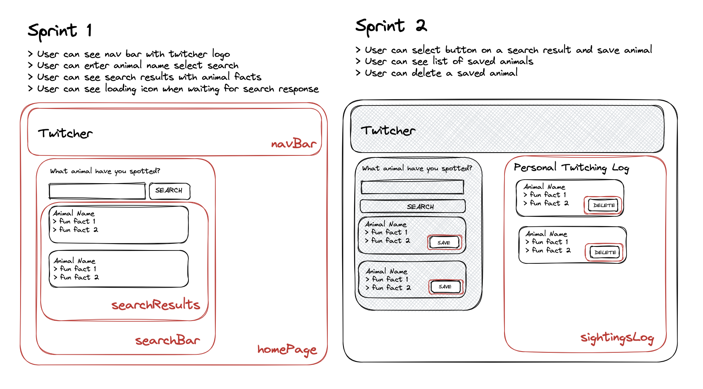
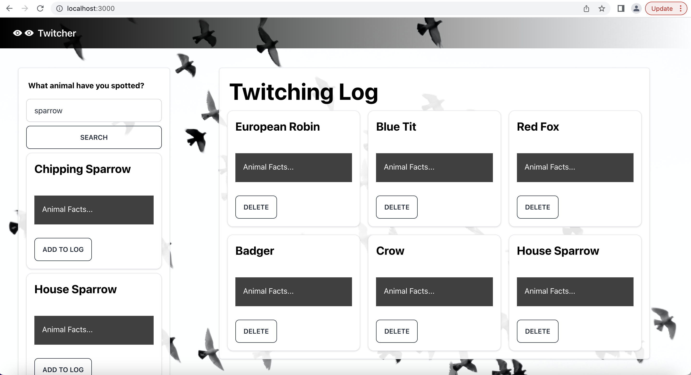
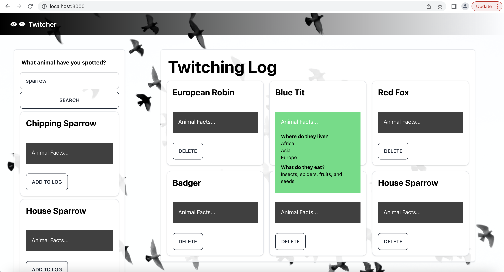

## Sprint 2

### User Stories

- User can select button on a search result and save animal
- User can see list of saved animals
- User can delete a saved animal

### Component Mock Ups

### Component Screen Shots

**Screen shots**

**Twitcher log with save and delete buttons**

**Twitcher log with facts expandeds**

### Learning Points

- Mongoose dropped support for callbacks from its node.js driver as of version 5.0. so I had to use async/await instead.
- Created reusable components - Made use of animal and animalFacts components within Search and Log sections.
